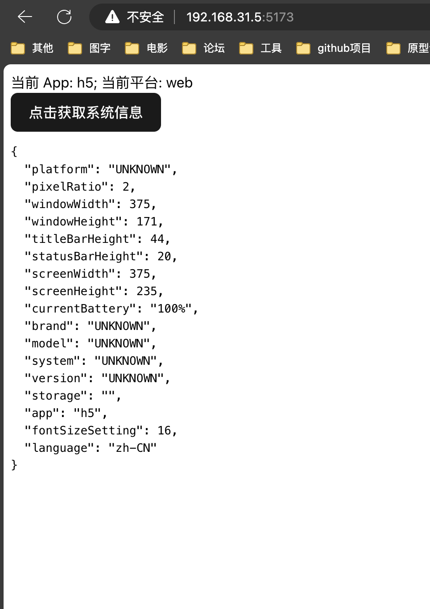
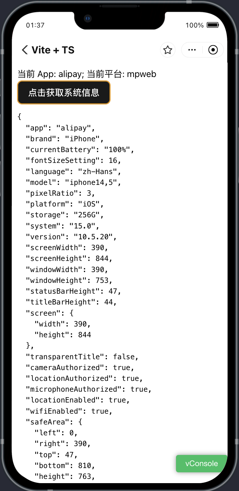
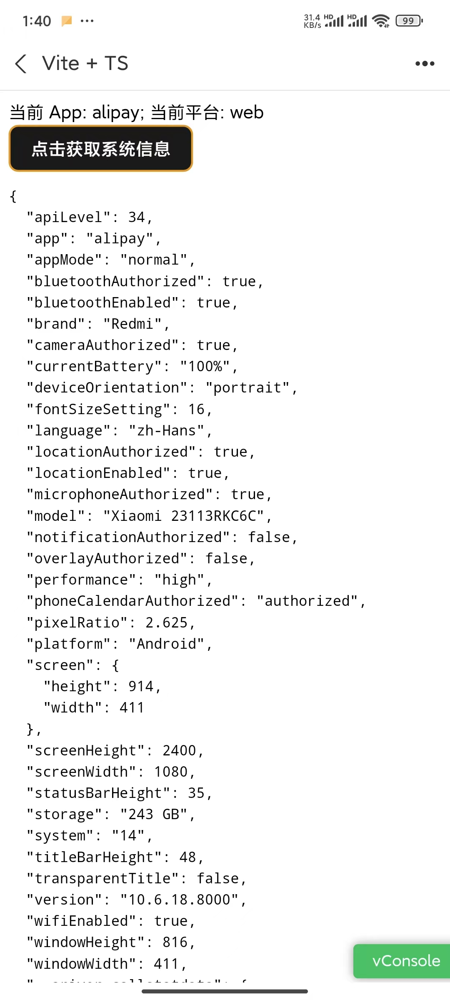

# hylid-bridge 跨端 JsApi

支付宝系小程序 JsApi 为基础的跨端 JS 库。

## 解决的问题

hylid-bridge 库在下面四种场景下，给开发者提供了一致的开发体验:

1. 支付宝系小程序包含国内淘宝、钉钉、阿里云盘、支付宝、咸鱼等 APP，国外 Tngd、GCash、TrueMoney等APP。每个 APP 或多或少对原生的支付宝本身的 JsApi 有特殊定制。本 JS 跨端库抹平各个 APP 差异，给开发者一致的开发体验。

2. 此外，支付宝小程序有个特殊的 web-view 组件，用来加载 H5 页面，H5 页面引入一段特殊的脚本后，可以实现与小程序的双向通信。本 JS 跨端库实现了一套简单好用的协议，可以实现在 H5 环境调用小程序的任意 JsApi。

3. 上面的 H5 还有可能直接投放到 App，投放到 App 里的 H5 会自动被 App 注入 AlipayJsBridge 脚本，可以通过该脚本调用 JsApi，但 JsApi 命名，传参是区别于小程序外另一套实现。本 JS 跨端库对 AlipayJsBridge 里的 JsApi 与小程序 JsApi 进行了对齐。

4. H5 在直接在浏览器环境打开，本 JS 跨端库也对小程序 JsApi 在浏览里进行了实现。

## 介绍

hylid-bridge 项目包含下面几个包:

|包名|功能|
|--|--|
|@hylid/env   | App 和 Platform 环境识别 |
|@hylid/call  | 调用 JsApi 的底层实现 |
|@hylid/types | JsApi 类型定义 |
|@hylid/custom-jsapi | 自定义非标准 JsApi |
|hylid-bridge |跨端基础库 |
|babel-plugin-hylid-bridge |最小化打包插件 |

### @hylid/env

env 包可以识别当前客户端是什么，是处于什么环境(是在小程序内、还是小程序 web-view 里的 H5，还是 App 直接打开的 H5，还是浏览器打开的 H5)。

```typescript
import { client, platform } from '@hylid/env'

// client 为当前 App 的名称
// platform 值为 mp、mpWeb、web，分别表示小程序，Webview H5，App 或者浏览器打开的 H5
```

### @hylid/call

call 包是调用底层 JsApi 的一层封装。call 中包含三种场景下的底层 call 调用。

1. 小程序场景**mpCall**。先尝试访问 my 对象上有无该 JsApi，没有的话，尝试 my.call() 调用
2. 小程序 Webview H5 场景**mpWebCall**。对 my.postMessage 和 my.onMessage 封装，实现一套通信协议，
3. App H5 场景**webCall**。对 AlipayJsBridge 进行上层封装

### hylid-bridge

hylid-bridge 在上面 `@hylid/env` 和 `@hylid/call` 基础上，对每个 App 单独进行 Api 的校验和适配和抹平差异。

JsApi 支持度，请[查阅 Npm 文档](https://www.npmjs.com/package/hylid-bridge)

## 使用

### 小程序

```typescript
import { showToast } from 'hylid-bridge';

Page({
  onClick() {
    showToast({
      content: 'hylid-bridge showToast',
    });
  },
});
```

### H5 体系

#### Modules

```tsx
import { showToast } from 'hylid-bridge';

export const App = () => {

  function onClick() {
    showToast({
      content: 'hylid-bridge showToast',
    });
  },

  return (
    <div onClick={onClick}>
      hylid-bridge
    </div>
  )
}
```

#### UMD

```html
<script src="https://cdn.jsdelivr.net/npm/hylid-bridge@3.0.0-alpha.11/lib/umd/index.min.js"></script>
<script>
  my.showToast({
    content: 'hylid-bridge showToast',
  });
</script>
```

## Demo

examples 中准备了两个 demo，分别在两个 demo 中安装依赖后，需要先启动 h5 项目后，启动 mp 项目才不会报错。




